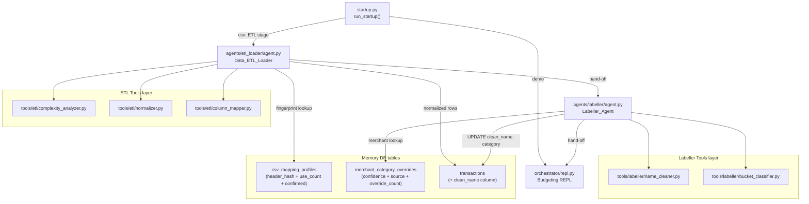

# Agentic Architecture Refactor — 6 Sub-Plans

## Current state (do not delete)

The following already work and are reused, not replaced:

- `[orchestrator/startup.py](orchestrator/startup.py)` — staged flow + `_show_columns_and_get_mapping()` HITL dialog (keep, extend)
- `[agents/db_manager.py](agents/db_manager.py)` — existing ETL LLM loop (refactored into `agents/etl_loader/`)
- `[agents/ledger_categorizer.py](agents/ledger_categorizer.py)` — existing labeller loop (refactored into `agents/labeller/`)
- `[db/db_schema.py](db/db_schema.py)` — schema + `migrate_schema()` (extended, not replaced)
- `[ingest/](ingest/)` — all ingest modules remain; agents call them as a library

---

## Full target data flow




---

## Sub-plan 1 — DB Schema extensions

**Goal**: Add columns and update `migrate_schema()`. No agent logic yet. All other sub-plans depend on this.

**Files changed**:

- `[db/db_schema.py](db/db_schema.py)` — `migrate_schema()` and `SCHEMA`

**Changes**:

- `transactions`: add `clean_name TEXT` via `ALTER TABLE` in `migrate_schema()`
- `csv_mapping_profiles`: add `use_count INTEGER DEFAULT 0`, `confirmed INTEGER DEFAULT 0`, `source_label TEXT` via migration
- `merchant_category_overrides`: add `confidence REAL DEFAULT 1.0`, `source TEXT DEFAULT 'user_confirmed'`, `override_count INTEGER DEFAULT 0` via migration

**Tests**: extend `tests/test_ingest_csv.py` to assert new columns exist post-`init_db()`.

---

## Sub-plan 2 — ETL deterministic tools layer

**Goal**: Pure deterministic Python tools for file analysis and normalization. No agent, no LLM.

**New files**:

- `tools/etl/__init__.py`
- `tools/etl/complexity_analyzer.py` — `analyze_complexity(path) -> ComplexityResult` using `openpyxl` metadata scan; returns `{is_complex, strategy: "pandas"|"html", stats}`
- `tools/etl/normalizer.py` — `normalize_dataframe(df, mapping, sign_rule) -> pd.DataFrame`; handles `sep=;` strip, CHF resolution (`Debit` preferred over `Amount` when `debit_credit` sign rule), date ISO conversion, outflow negation
- `tools/etl/column_mapper.py` — `heuristic_map(headers) -> dict`; wraps existing `[ingest/csv_detect.py](ingest/csv_detect.py)` logic, computes `header_fingerprint = sha256(sorted_headers)`

**Tests**: `tests/test_etl_normalizer.py` using the actual Mastercard CSV at `data/imports/mastercard_transaction_Jan-May_2026.csv`

---

## Sub-plan 3 — ETL Loader Agent

**Goal**: Refactor `[agents/db_manager.py](agents/db_manager.py)` into `agents/etl_loader/` with format-memory auto-apply and the excel-parser Scout Pattern as a SKILL.

**New files**:

- `agents/etl_loader/__init__.py`
- `agents/etl_loader/agent.py` — LLM loop; replaces `run_db_manager_agent()`; tool set: `scan_folder`, `check_complexity`, `lookup_format_profile`, `show_columns_ask_user`, `import_file`, `save_format_profile`
- `agents/etl_loader/tools.py` — deterministic implementations calling `tools/etl/` and `ingest/`
- `skills/etl_loader/SKILL.md` — Scout Pattern SKILL with YAML frontmatter; steps: Scout → Sample → Column dialog → Normalize → Store

**Key logic in `agent.py`**:

```
scan_folder(path) → files
for each file:
    fingerprint = column_mapper.header_fingerprint(file)
    profile = lookup_format_profile(fingerprint)
    if profile.confirmed and profile.use_count >= 2:
        auto-apply silently, show one-line confirmation
    else:
        show_columns_ask_user() → mapping (existing HITL dialog)
        save_format_profile(fingerprint, mapping, confirmed=True)
    normalize + import → transactions table
```

`[agents/db_manager.py](agents/db_manager.py)` is kept but `run_db_manager_agent` is delegated to the new module.

---

## Sub-plan 4 — Labeller deterministic tools layer

**Goal**: Pure deterministic tools for name cleaning and bucket classification. No agent, no LLM.

**New files**:

- `tools/labeller/__init__.py`
- `tools/labeller/name_cleaner.py` — `clean_merchant_name(raw: str) -> str`; regex strips trailing location/country suffix (`" {2,}[A-Z ][A-Z ]+$"`), collapses internal whitespace, title-cases; example: `"UPTRACK+                 RENNES       FRA"` → `"UpTrack+"`
- `tools/labeller/bucket_classifier.py` — `classify_bucket(txn, sector_hint) -> tuple[str, float]`; wraps `[tools/categorize.py](tools/categorize.py)`; sector column is used as override with confidence 0.85; unknown → LLM fallback at confidence 0.5

**Tests**: `tests/test_name_cleaner.py` with Mastercard raw names; `tests/test_bucket_classifier.py` with sector values from the CSV.

---

## Sub-plan 5 — Labeller Agent

**Goal**: Refactor `[agents/ledger_categorizer.py](agents/ledger_categorizer.py)` into `agents/labeller/` with clean-name step, merchant memory lookup, and confidence-tiered batch confirmation.

**New files**:

- `agents/labeller/__init__.py`
- `agents/labeller/agent.py` — LLM loop; tool set: `fetch_unlabelled`, `lookup_merchant_memory`, `propose_clean_name`, `propose_bucket`, `batch_confirm_with_user`, `apply_labels`
- `agents/labeller/tools.py` — deterministic implementations calling `tools/labeller/` and querying `merchant_category_overrides`
- `skills/labeller/SKILL.md` — YAML frontmatter SKILL; steps: Fetch → Memory lookup → Clean names → Classify → Tier by confidence → Batch confirm → Persist

**Confidence-tiered UX** in `batch_confirm_with_user`:

```
AUTO-APPLIED  (confidence >= 1.0 AND source = user_confirmed AND use_count >= 2)
  → accept all with single keypress, no per-row display

NEEDS REVIEW  (new merchants OR confidence < 1.0)
  → show table: raw name | clean name | CHF | proposed bucket | sector hint
  → per-row: Enter=accept, n=need, w=want, s=savings, e=edit name
```

After user confirms, UPDATE `transactions.clean_name` and `transactions.category`, then INSERT/UPDATE `merchant_category_overrides` with `source='user_confirmed'`, `confidence=1.0`.

`[agents/ledger_categorizer.py](agents/ledger_categorizer.py)` is kept; its `run_ledger_categorizer()` is aliased to the new module for backward compatibility with existing REPL `/cat-run` command.

---

## Sub-plan 6 — Startup & Router wiring

**Goal**: Update `[orchestrator/startup.py](orchestrator/startup.py)` to dispatch ETL → Labeller → REPL in sequence. Remove overlap between `stage_import()` and `stage_db_manager()`.

**Files changed**:

- `[orchestrator/startup.py](orchestrator/startup.py)`

**Changes to `StartupStage` enum**:

```python
class StartupStage(Enum):
    MODEL = "model"
    DATA_SOURCE = "data_source"
    PERSISTENCE = "persistence"
    ETL_LOADER = "etl_loader"    # replaces DB_MANAGER
    LABELLER = "labeller"        # new stage
    REPL = "repl"
```

**Changes to `run_startup()`**:

```
csv path:
  stage_persistence() → db_path
  init_db(db_path)
  stage_etl_loader()  → calls agents/etl_loader/agent.py
  stage_labeller()    → calls agents/labeller/agent.py
  → REPL
```

- Remove `stage_import()` (its HITL logic is now owned by `etl_loader/agent.py`)
- Keep `stage_categorize()` and `stage_summary()` as internal helpers called from the new stage functions
- Update `StartupStage.DB_MANAGER` references to `ETL_LOADER` (one rename in `repl.py` if referenced)

No changes needed to `[orchestrator/router.py](orchestrator/router.py)` — budgeting skills remain unchanged.

---

## Execution order

Sub-plans must be executed in this order (each depends on the previous):

1. Schema extensions (no code deps)
2. ETL tools layer (depends on schema columns existing)
3. ETL Loader Agent (depends on ETL tools)
4. Labeller tools layer (depends on `clean_name` column from sub-plan 1)
5. Labeller Agent (depends on Labeller tools)
6. Startup wiring (depends on both agents existing)

