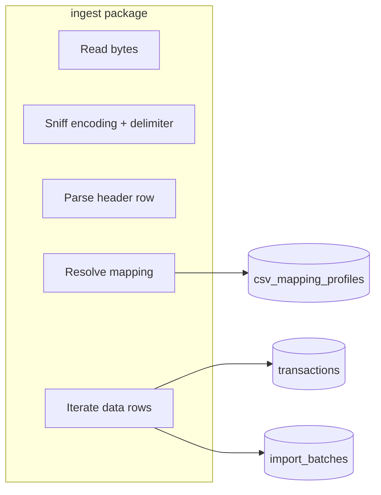

# CSV import and ledger categorization

This document describes how **bank CSV exports** are ingested into the same SQLite ledger as the demo, how **column mappings** are persisted and reused, and how a **separate ledger categorization agent** proposes `need` / `want` / `savings` buckets and fine **line categories** with **human-in-the-loop** confirmation before anything is written to `transactions.category` / `transactions.line_category`.

For day-to-day usage (environment variables and slash commands), see [REPL_README.md](../REPL_README.md). High-level architecture rules live in [CLAUDE.md](../CLAUDE.md).

---

## Design goals

1. **No second `BankingProvider`.** CSV ingestion writes normal `transactions` rows; reads still go through `DBBankingProvider` like today.
2. **Deterministic ingest.** Header detection, decoding, delimiters, amounts, dates, fingerprints, and balance reconciliation are pure Python in `ingest/` — no LLM.
3. **Persisted mapping.** Column layouts are stored per user so later sessions (with a file-backed DB) can skip re-detection when the header hash matches.
4. **Second LLM agent.** Budgeting stays in `orchestrator/router.py` + skills. Tagging outflows uses `agents/ledger_categorizer.py` only, with its own tools and prompts.
5. **HIL for categories.** The model only inserts **proposals** (`category_proposals`). The user applies them via the REPL (`/cat-accept`), which runs deterministic `UPDATE` statements.

---

## Repository layout

| Path | Role |
|------|------|
| [`ingest/csv_detect.py`](../ingest/csv_detect.py) | Header alias scoring, ambiguity vs resolved mapping, delimiter/encoding sniff |
| [`ingest/csv_normalize.py`](../ingest/csv_normalize.py) | Decimal and date parsing; signed amount from `single_amount` or `debit_credit` |
| [`ingest/profiles.py`](../ingest/profiles.py) | CRUD for `csv_mapping_profiles` |
| [`ingest/importer.py`](../ingest/importer.py) | `preview_csv_file`, `import_csv_files`, `rollback_import_batch` |
| [`ingest/cli.py`](../ingest/cli.py) | `python -m ingest.cli <file.csv>` — JSON preview for scripts/CI |
| [`agents/ledger_categorizer.py`](../agents/ledger_categorizer.py) | Small `LLMProvider` tool loop (narrow system prompt) |
| [`agents/ledger_tools.py`](../agents/ledger_tools.py) | `propose_spending_bucket`, `propose_line_category`, list/apply/reject proposals |
| [`orchestrator/repl.py`](../orchestrator/repl.py) | Slash-command glue only; no business logic duplication |

---

## Database additions

Defined in [`db/db_schema.py`](../db/db_schema.py). `migrate_schema()` adds new columns on older databases that already had a `transactions` table.

### `csv_mapping_profiles`

Stores a user-named mapping: JSON `column_map` (logical field → exact CSV header), plain-text `sign_rule` (`single_amount` or `debit_credit`), `encoding`, `delimiter`, and `header_hash` for auto-selection on the next import.

### `import_batches`

One row per import attempt per file path: `content_sha256`, counts, `mapping_profile_id`, `status` (`completed` | `partial` | `rolled_back`). Unchanged file bytes skip re-import unless forced.

### `transactions` (extra columns)

| Column | Purpose |
|--------|---------|
| `line_category` | Fine label (e.g. `groceries`, `rent`) after HIL or manual set |
| `import_batch_id` | Links rows to a batch for rollback |
| `external_fingerprint` | SHA-256 of normalized `(date, amount, merchant)` for dedupe |

Partial unique index: `(account_id, external_fingerprint)` when fingerprint is not null.

### `category_proposals`

Pending or terminal rows for the ledger agent. At most one **pending** row per `txn_id` is merged in code (bucket and line updates patch the same row).

### `merchant_category_overrides`

Reserved for future “remember this merchant” behavior; schema is present for extension.

---

## Ingest pipeline



**Mapping resolution order** (in `import_csv_files`):

1. Explicit `profile_id` argument (REPL: `/import profile <uuid>`).
2. Profile whose `header_hash` matches the current file header.
3. Auto-detect via `detect_mapping`. If the result is `MappingAmbiguity`, the file is skipped and the reason is returned in `ImportResult`.

**Dedupe:**

- **File level:** same `content_sha256` as a completed batch for that path → skip (unless `force_reimport`).
- **Row level:** same `external_fingerprint` for the account → row not inserted; `skipped_duplicate_count` incremented.

**Balance:** after inserts, `accounts.balance` is set to `SUM(transactions.amount)` for that account (single source of truth).

**Currency:** non-CHF rows are skipped with a warning (demo contract is CHF).

**Income:** imports do not require income rows, but `compute_split` still needs income inside the analysis window — the importer warns when a file has no positive amounts.

---

## Ledger categorization agent

- **Entry:** `run_ledger_categorizer(llm, conn, user_id, …)` in [`agents/ledger_categorizer.py`](../agents/ledger_categorizer.py).
- **Tools (OpenAI-style JSON passed to `LLMProvider.complete`):**
  - `propose_spending_bucket` — `need` | `want` | `savings` for an outflow `txn_id`.
  - `propose_line_category` — one of the closed labels in `LINE_CATEGORY_VOCABULARY` in [`agents/ledger_tools.py`](../agents/ledger_tools.py) (aligned with Swiss-style buckets such as `rent`, `health_insurance`, `groceries`, `dining`, …).
- **Not wired** into `llm/tool_definitions.py` or `orchestrator/router.py` — the budgeting agent cannot silently approve categories.

Use **`/setup`** in the REPL for a full checklist covering the import folder, `LUCID_DB_PATH` / `LUCID_LEDGER`, and the slash commands below.

**Human verification (REPL):**

| Command | Action |
|---------|--------|
| `/cat-run` | Run the categorizer LLM on a batch of uncategorized outflows |
| `/review-categories` | Table of pending proposals + deterministic `categorize_transaction` hint |
| `/cat-accept <proposal_id> [bucket need] [line groceries]` | Apply to `transactions` and mark proposal accepted |
| `/cat-reject <proposal_id>` | Mark proposal rejected |

---

## REPL environment switches

| Variable | Effect |
|----------|--------|
| `LUCID_DB_PATH` | SQLite path; default `:memory:` (ephemeral). Use a file path to persist profiles and imports. |
| `LUCID_IMPORT_DIR` | Where `/import` looks for `*.csv`; default `data/imports`. |
| `LUCID_LEDGER` | `demo` (default): seeded demo transactions. `import`: minimal user + empty ledger for CSV-first workflows. |

---

## Tests

- [`tests/test_ingest_csv.py`](../tests/test_ingest_csv.py) — header detection, import insert/dedupe, profile round-trip, rollback, preview.
- [`tests/test_ledger_tools.py`](../tests/test_ledger_tools.py) — invalid bucket rejection, propose + apply updates `transactions`.

Run:

```bash
uv sync --extra dev
uv run pytest tests/test_ingest_csv.py tests/test_ledger_tools.py -q
```

---

## Related documentation

| Document | Content |
|----------|---------|
| [REPL_README.md](../REPL_README.md) | Slash commands, env vars, CSV workflow for users |
| [CLAUDE.md](../CLAUDE.md) | Global architecture constraints (`BankingProvider`, `ingest/`, agents) |
| [docs/STAGE_1.md](STAGE_1.md) | Contracts and `BankingProvider` baseline |
| [docs/STAGE_2.md](STAGE_2.md) | Deterministic `tools/` core |

This file is the **feature reference** for CSV import and ledger-side categorization; it is intentionally **not** named after a numbered stage.
