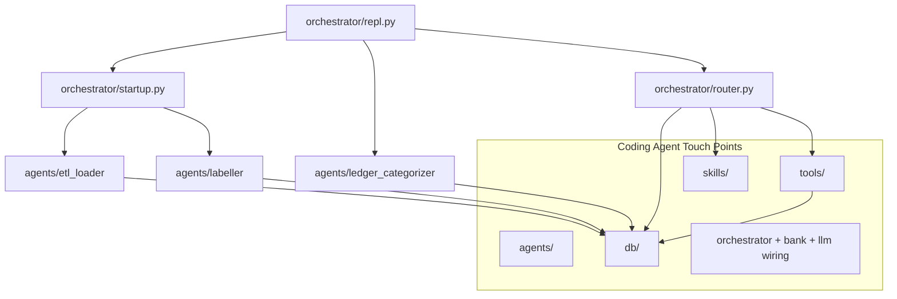

# Project Overview

## Source of truth

- [CLAUDE.md](../../CLAUDE.md) — primary architecture document
- Entry point: `uv run lucid-agent` → [orchestrator/repl.py](../../orchestrator/repl.py)
- Package config: [pyproject.toml](../../pyproject.toml)

## What it does

LUCID-AGENT-DEMO is an LLM-provider-agnostic personal finance agent. It helps users define budgets, categorizes transactions, and feeds a dashboard. The demo runs against a **simulated bank** (real SIX Swiss open-banking comes later behind the same `BankingProvider` interface). Currency is **CHF**; amounts are **negative for outflows**.

Coding agents touch five main areas: `tools/` (deterministic math), `skills/` (LLM judgment), `agents/` (separate onboarding loops), `db/` (authoritative state), and `orchestrator/` (wiring + REPL).

## Component map

## Key directories

| Path | Role |
|------|------|
| `bank/` | `BankingProvider` interface + `SimulatedBank`, `DBBankingProvider` |
| `llm/` | `LLMProvider` interface + LiteLLM adapter |
| `tools/` | Deterministic functions — money math, categorization, dashboard |
| `skills/` | `SKILL.md` procedures loaded by router |
| `agents/` | Separate LLM loops (ETL, labeller, ledger categorizer) |
| `ingest/` | Deterministic CSV parsing (not a second bank) |
| `db/` | SQLite schema and query helpers |
| `orchestrator/` | REPL, router, context assembly, startup |
| `tests/` | pytest suite — every new tool needs a test |

## How to extend

- Add features in the layer that owns the concern (see [layer-rules.md](layer-rules.md)).
- Never bypass interfaces to "save time" — swapping simulator for SIX must stay a one-line wiring change.
- Read [conventions/](../conventions/) before your first PR.

## Related pages

- [layer-rules.md](layer-rules.md)
- [memory-layers.md](memory-layers.md)
- [startup-pipeline.md](startup-pipeline.md)
- [conventions/imports-and-wiring.md](../conventions/imports-and-wiring.md)
